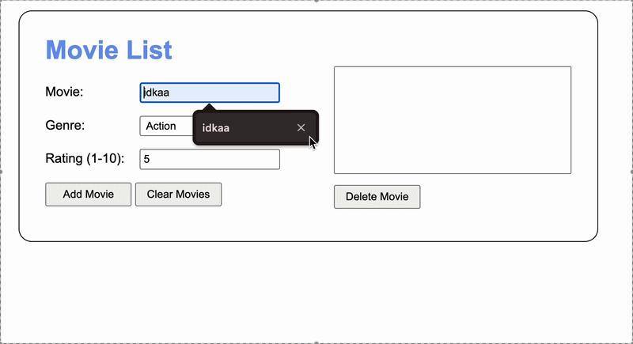

# Movie Tracker
## Output

## Table of Contents
* [Authors](#authors)
* [Purpose](#purpose)
* [Script Breakdown](#script-breakdown)
* [New Concepts Used](#new-concepts)
* [Credits](#credits)

## Authors
* [Kyler Hanson](https://github.com/kyhans07)
* [Project](https://github.com/kyhans07/ch11-12-13-movie-tracker)

## Purpose
This program allows users to maintain a personal database of movies they have watched.
It captures the title, genre, and a 1-10 rating, providing an organized display
that sorts entries logically by genre and quality to help users track their media history.

## Script Breakdown
### Important Globals
* `Movies` - A private array within the `movieList` module that holds the collection of Movie objects.

### Functions and Listeners
* `displayMovies`
    * Retrieves the latest list from storage, triggers the sort logic, and dynamically creates HTML option elements to populate the UI.
* `movieList.add`
    * Appends a new Movie instance to the collection and returns the object for method chaining.
* `movieList.delete`
    * Re-sorts the list to ensure index alignment and removes the selected movie from the collection.
* `movieList.sort`
    * Implements a multi-level sort: Primary (Genre), Secondary (Rating - Descending), and Tertiary (Title).
* `movieStorage.retrieve`
    * Handles the transition from raw JSON data back into functional Class instances of `Movie`.
* `dom.addClick`
    * A wrapper function that attaches event listeners to UI buttons for adding, deleting, or clearing data.

## New Concepts
* ES Modules & Import Maps
* Class Inheritance and instance methods
* Multi-level Array Sorting
* Method Chaining
* Local Storage Persistence with JSON serialization
* Iterator Protocol (`Symbol.iterator`) for custom object looping

## Credits
* Starter code structure adapted from a Task Manager project.
* CSS styling and DOM utility modules provided via general_modules.
